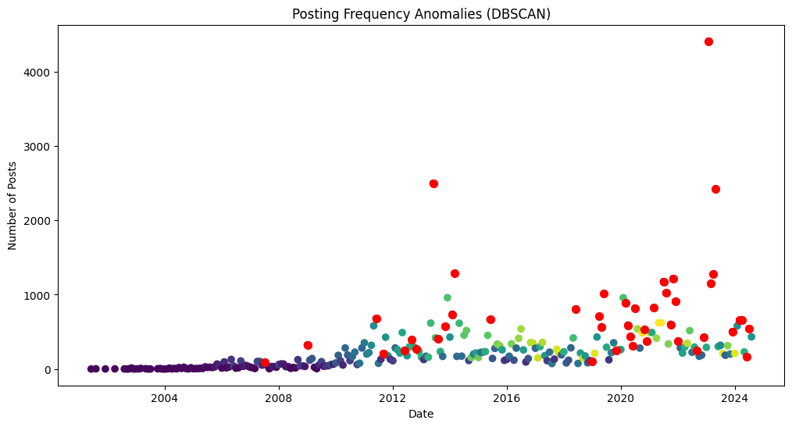
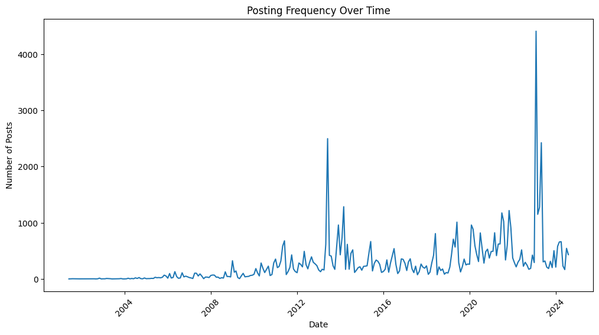
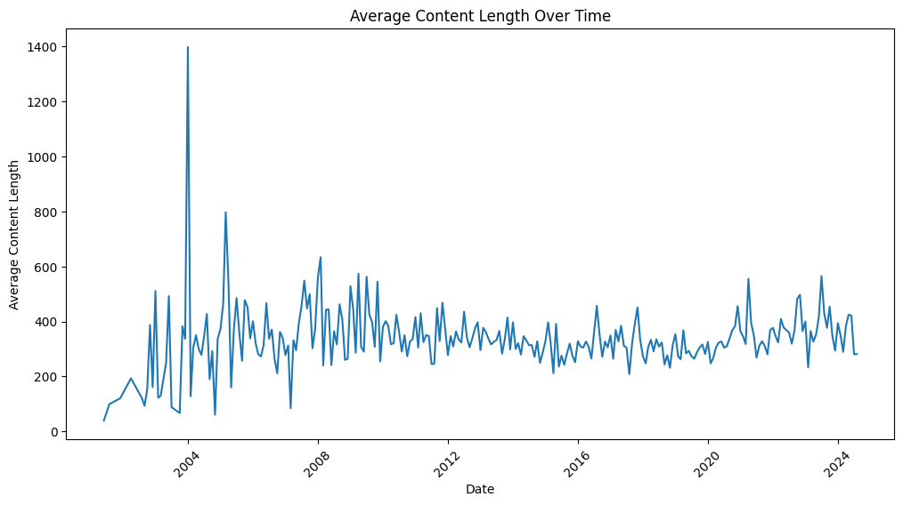
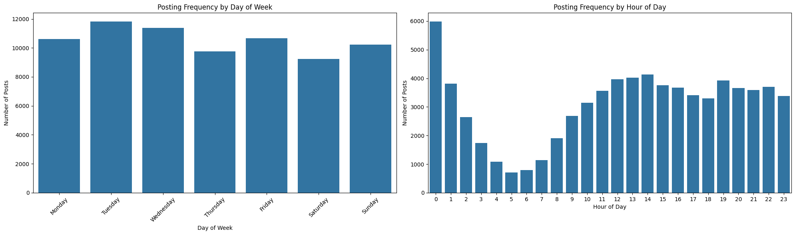
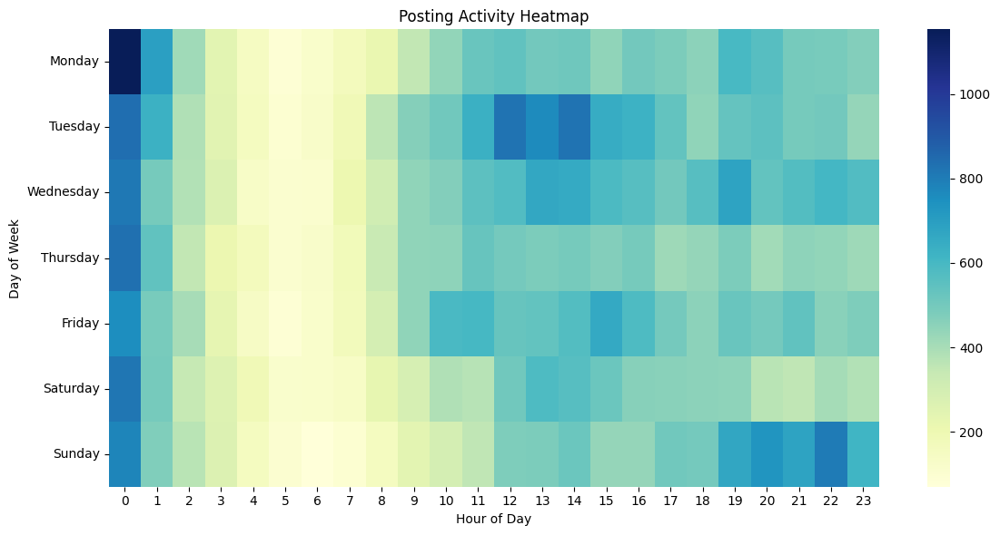
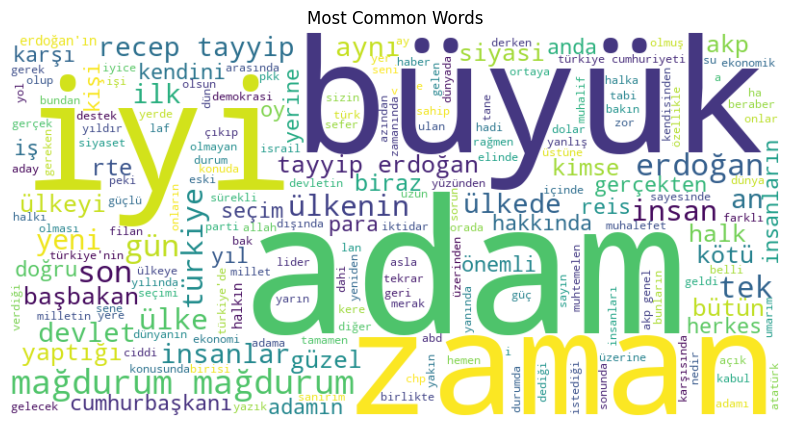
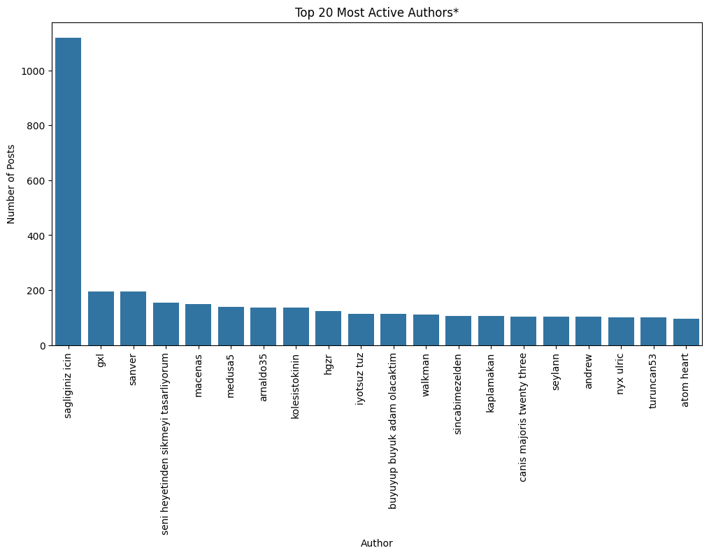
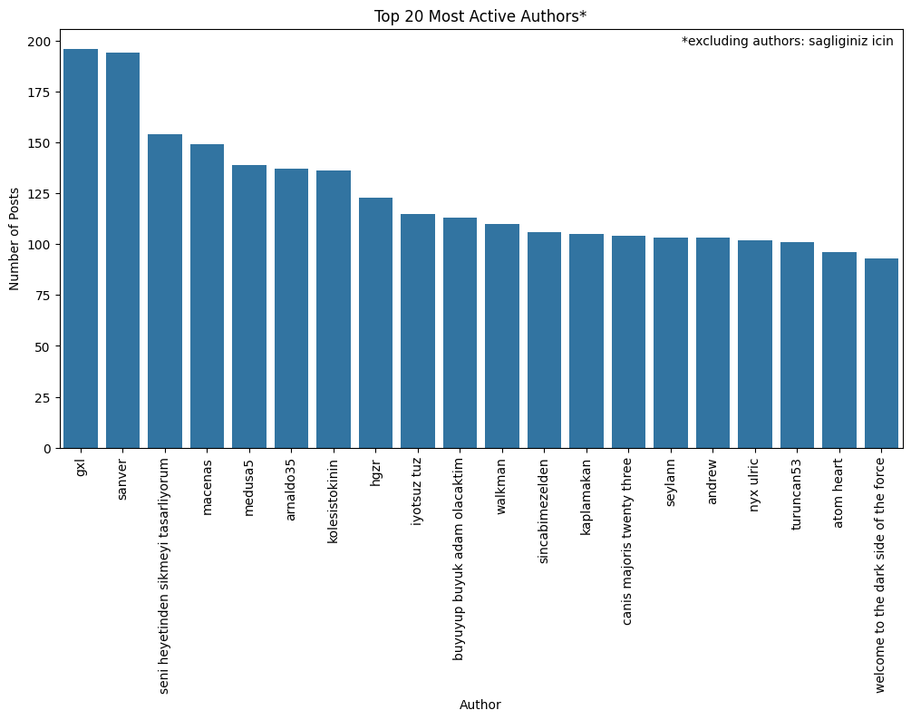

# Eksisozluk Erdogan Thread Analysis: Insights into Turkish Social Media Discourse (2001-2024)

This report presents a detailed analysis of social media discourse surrounding President Recep Tayyip Erdogan on Eksisozluk, a popular Turkish social media platform. The analysis covers over 70,000 entries from June 15, 2001, to August 22, 2024, providing crucial insights into public sentiment, discussion patterns, and important events on Turkish history.

## 1. Key Findings

### 1.1 Significant Correlation Between Political Events and Posting Activity



Analysis of the data reveals a strong correlation between major political events in Turkey and spikes in posting frequency about President Erdogan. The most notable surges occurred during the Gezi Park protests in June 2013, with 2,496 posts in that month alone-a nearly tenfold increase from the average monthly posting rate-and 2023 presidential elections with 4,407 posts in February alone.





### 1.2 Long-term Increase in Engagement

The data shows a general upward trend in posting frequency over the two-decade span, indicating growing public engagement with topics related to President Erdogan. This trend aligns with his increasing influence in Turkish politics and the rising popularity of the platform itself.

### 1.3 Electoral Cycles Drive Discourse

Significant spikes in posting activity consistently coincide with Turkish election periods, demonstrating the platform's role as a measure of political engagement:

- June 2015: "Turkish General Election" 
- June 24, 2018: "Turkish Presidential and Parliamentary Elections"
- May-June 2023: Lead-up to the "Turkish Presidential and Parliamentary Elections"

### 1.4 Crisis and Policy Changes Trigger Increased Discussion

Anomalies in posting frequency often correspond to important events such as:

- July 2016: Attempted coup (data shows increased activity in following months)
- March 2020: COVID-19 pandemic response 
December 2021: Currency crisis and economic downturn

### 1.5 Evolution of Content Depth



While there are fluctuations, the average content length has shown a general stabilization over time, with occasional spikes. This suggests that while engagement remains high, the nature of discourse may have evolved from longer, detailed entries to more frequent, short comments.

## 2. Data Source and Methodology

### 2.1 Source: Eksi Sozluk, A Major Turkish Social Media Platform

This analysis is based on data extracted from Ekşi Sözlük, a popular Turkish social media platform that serves as a crucial digital public sphere. Key characteristics of this source include:

- Founded in 1999.
- Over 400,000 registered users with approximately 110,000 active writers.
- Significant platform for social and political commentary.
- Temporarily banned in Turkey by authorities in 2023.

### 2.2 Data Collection and Scope

- Asynchronous data scraper developed for efficient data collection made by me.
- Total entries analyzed: 73,710
- Unique contributors: 22,034
- Date range: June 15, 2001, to August 22, 2024

### 2.3 Analysis Methodology

- Time series analysis to identify posting frequency trends and anomalies.
- Content length analysis to track the depth of the discussion.
- Correlation of posting patterns with significant political events and electoral cycles.
- Additionally, interactive Plotly html plots can be generated by running the notebook, and they will be saved in the `./output/figures` directory. These plots provide dynamic visualizations for deeper exploration of the data and can be viewed using any web browser.

### 2.4 Methodological Considerations

- Platform Demographics: Majority of users ages 18-35, with a male majority.
- Moderation: Entries subject to moderation, potentially affecting data representativeness. Additionally, court orders and government requests can lead to content removal under Article 299 of the Turkish Penal Code.
- Bias Awareness: Userbase seen as more liberal and progressive-leaning than the general Turkish population, although diversity has increased over time.
- Potential Manipulation: Allegations of paid posters and bots, common in Turkish social media, especially in political discussions.

## 3. Detailed Analysis

### 3.1 Temporal Patterns of Discourse



Key observations:

- Peak activity occurs on Tuesdays and Wednesdays, increasing political engagement mid-week.
- A significant increase in posts at midnight, indicating active nighttime engagement. 
- Sustained high activity at evening hours, aligning with leisure time after work.



### 3.2 Content Analysis



Analysis of the most common words in the dataset reveals key points of the political discourse around Erdogan:

- "Büyük" (great/big): Potentially referring to Erdogan as a significant figure; also a common adjective in Turkish.
- "Oy" (vote): Reflecting discussions around elections and voting behavior.
- "Seçim" (election): Highlighting the importance of electoral processes in the discourse.
- "AKP": Erdogan's political party, indicating a focus on party politics.
- "Mağdurum" (I am a victim): Indicates expressions of personal grievances, possibly related to government policies; notably influenced by an entry where the word is used extensively.

### 3.3 Author Behaviour 





Key insights:
- Extreme outlier: One author contributed over 1,000 entries, potentially a spammer or bot.
- Beyond the top outlier, there's a consistent distribution of contributions across authors.

## 4. Conclusion

### 4.1 Sentiment and Engagement

The analysis of Ekşi Sözlük entries provides valuable insights into Turkish political sentiment:

- The high frequency of election related terms suggests a userbase actively engaged in political discourse.
- The 'mağdurum' (I am a victim) sentiment indicates a mix of personal grievances and broader political dissatisfaction.
- The personalization of political discourse, evident in frequent reference of Erdogan, indicates a strong focus on individual leadership.

### 4.2 Information Environment 

- The platform's realtime nature and responsiveness to events make it a key place for narrative control in Turkish digital space.
- The presence of highly active users suggests an ongoing effort to shape public opinion through social media.

### 4.3 Electoral Dynamics and Predictive Indicators

- Significant spikes in activity during election periods and major political events demonstrates the platform's value as a predictive tool for monitoring public sentiment and potential electoral outcomes.
- The data peaks at politically sensitive times with increasing frequency in recent years, indicating an intensification of political engagement.
- These patterns could serve as early warning indicators for political shifts and social unrest.

For futher analysis of the site, a sentiment analysis tool could provide valuable insights into the evolving dynamics of Turkish political discourse. A system to track sudden changes in posting frequency could also help identify emerging issues and crises in real-time.


In conclusion, while being not representative of the entire Turkish voter base, Eksisozluk allows us to gain insights into the political discourse and public sentiment surrounding President Erdogan. The platform's data provides a valuable resource for understanding the evolving dynamics of Turkish politics and society.


# 5. Installation Instructions

To replicate the analysis and generate the report, follow these steps, you might want to use a virtual environment:

1. Clone the repository:

```bash
// link will come here
cd eksisozluk-erdogan-analysis
```

2. Install dependencies:

```bash
pip install -r requirements.txt
```

Now, you can run the analysis and generate the plots and get the data by running blocks in the Jupyter notebook `noteboooks/eksisozluk_erdogan_analysis.ipynb`. Plots and data will be saved in the `output` directory.

## 6. Future Work and TODOs:

- Add more comprehensive tests to the functions.
- Sentiment analysis of the entries to understand the emotional context of the discourse.
- Investigate the role of paid posters and bots in shaping the discourse.
- Expand the analysis to other political figures and topics to provide a broader context, and to compare with the Erdogan thread.
- Explore the potential of machine learning models to identify patterns and trends in the data.
